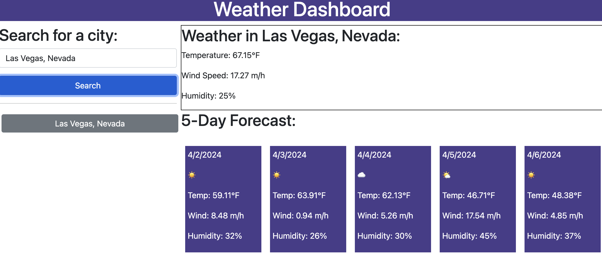

# 06-Challenge
Challenge #6: Build a weather app

## Description

This app is a weather app using the OpenWeather API to generate the weather conditions for a user generated search. The app allows the user to input a city and state and the weather for that input is displayed. The app saves 5 of your most recent searches and gives the user a 'quick click' option to get the weather.

The app also displays a 5-Day forecast as well!

GitHub: https://github.com/chrislose23
Deployed: https://chrislose23.github.io/06-challenge/

## Usage

Once the page loads, enter your location into the search bar. Please enter city and state. (Example: Cleveland, Ohio)

Once the search is submitted, the current weather is displayed as well as a 5-Day forecast. The search is also saved into local storage and shown under the search bar.

You can save up to 5 of your most recent searches and use them as 'quick clicks' to access your weather data quickly.

The saved searches will be loaded on the app after reload or on your next visit.

## Credits

Our API: https://openweathermap.org/

Learning Tools: 
https://www.w3schools.com/
https://getbootstrap.com/

## License

This app uses a MIT license.

---